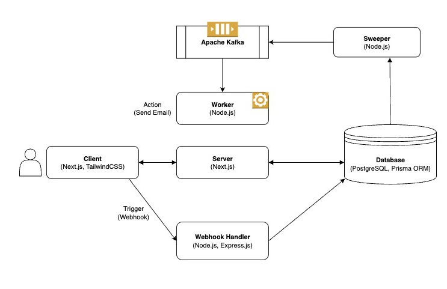

# Automation Application (Zapier Clone)

## Overview

Designed and developed a scalable automation platform inspired by Zapier, enabling users to create customizable workflows by configuring triggers and actions. Implemented one trigger (Webhook) and one action (Send Email) for seamless automation.

## Key Highlights

- Built an intuitive React-based UI using **Next.js** and **TailwindCSS** for effortless creation and management of triggers and actions.
- Implemented a robust **event-driven architecture**: webhook triggers enqueue tasks into **Apache Kafka** topics, which are then processed asynchronously by a worker service to execute actions reliably.
- Integrated **SendGrid SDK** for sending emails based on trigger data, automating user workflows.
- Leveraged **TypeScript** and **Turborepo** for type-safe, modular development and monorepo management across frontend and backend codebases.

## Tech Stack

- **Frontend:** Next.js, TypeScript, TailwindCSS
- **Backend:** Node.js, Apache Kafka
- **Email Service:** SendGrid SDK
- **Database:** PostgreSQL (Prisma ORM)
- **Architecture:** Monorepo (Turborepo)

## System Design

